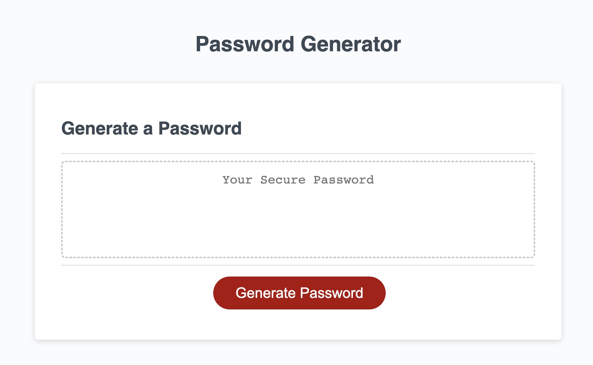

# Password Challenge

## Description

This project was to take existing code and create logic to generate and display a password based on a user's responses to window prompts. The user is asked for a password length, then whether or not to include other password characteristics. There is logic to validate the inputs are within the password requirements, such as ensuring the length is between 8 and 128 characters. It also makes sure at least one type of character is chose between lowercase letters, uppercase letters, numbers, and special characters. The algorithm will run as many times as the indicated length and randomly choose a character from the user's selections.

[Link To Page](https://asreedy82.github.io/password-challenge/)

## Installation

N/A

## Usage

The webpage is intended to help someone generate a random password based on specified criteria. To use the application, click on the red 'Generate Password' button and follow the prompts. The result will be a random password meeting the criteria you chose.

## Credits

N/A

## License

N/A

### Author: Anthony Reedy